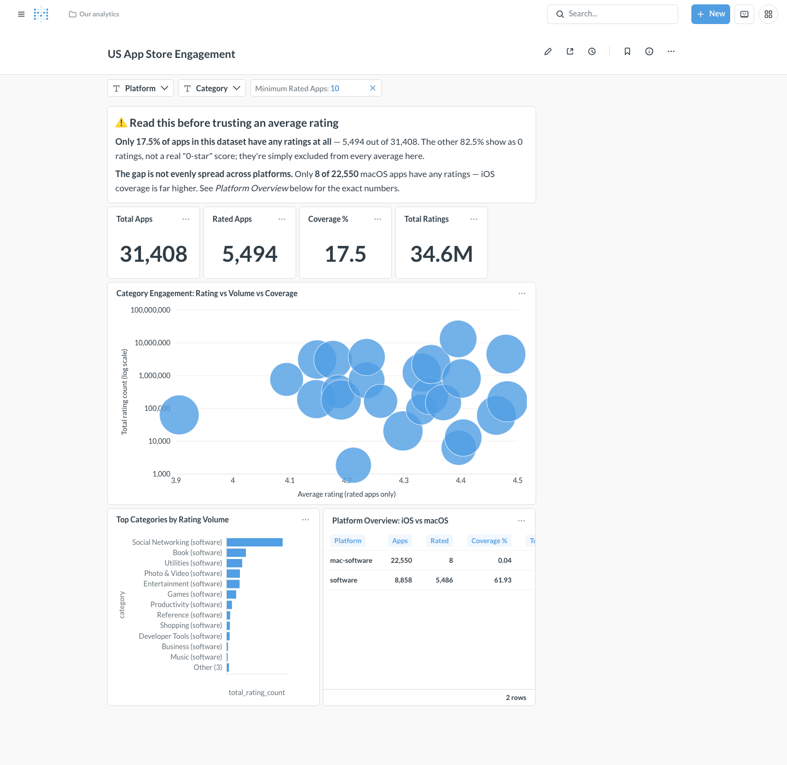

# App Store Product Intelligence

Analytics engineering project built on public Apple App Store data,
providing information for spcified company and relevant competitors
across different countries.


## Architecture

```
Apple iTunes Search API / bulk metadata CSV
        |
        v
Python ingestion
        |
        v
PostgreSQL (raw -> staging -> marts)
        |
        v
Metabase
        |
        v
Product / market intelligence
```

PostgreSQL is the single database for raw data, staging, marts, **and**
Metabase's own application metadata (in a separate database on the same
instance) — no DuckDB, no BigQuery, no second database server. dbt isn't
introduced yet either; transformations are plain SQL run directly against
Postgres.


## Project layout

```
ingestion/
  itunes_client.py   # iTunes Search API client
  config.py           # loads search config (term/country/entity) from .env
  fetch_apps.py       # one-off exploratory script, see "Ingestion" below
transform/
  db.py                        # shared PostgreSQL connection helper
  load_raw.py                  # CSV -> Postgres raw table (COPY)
  build_staging.py             # raw -> stg_apps + data-quality checks
  build_marts.py                # stg_apps -> mart_app_category_engagement + checks
  sql/stg_apps.sql
  sql/mart_app_category_engagement.sql
metabase/
  setup_dashboard.py      # idempotent: admin setup, DB connection, cards, dashboard
tests/
  conftest.py           # pg_conn fixture: isolated Postgres schema per test
  test_itunes_client.py
  test_config.py
  test_stg_apps.py
  test_mart_app_category_engagement.py
postgres/init/             # runs once on first Postgres boot — creates the metabase db
docker-compose.yml       # local PostgreSQL + Metabase
docs/dashboard-screenshot.png
.env.example              # template — copy to .env and fill in your own values
data/raw/                  # fetched raw JSON (gitignored, not committed)
metadata-US.csv            # bulk App Store metadata export (not committed)
```

## Setup

Requires Python 3.10+ and Docker.

```bash
python3 -m venv .venv
source .venv/bin/activate
pip install -r requirements-dev.txt
cp .env.example .env          # then edit .env with your own search term/country/entity
docker compose up -d          # starts local PostgreSQL + Metabase
python3 -m transform.build_marts     # loads the CSV and builds stg_apps + the mart
python3 -m metabase.setup_dashboard  # sets up Metabase and the dashboard
```

`.env` is gitignored and never committed — see [Configuration](#configuration).
The last two commands need [metadata-US.csv](metadata-US.csv) present at the
repo root (not committed — ask for a copy or provide your own export with the
same columns).

## Database (PostgreSQL)

`docker-compose.yml` runs a single local Postgres instance (`postgres:16-alpine`)
that holds raw data, staging, marts, and (in a separate database) Metabase's
own application metadata. Connection settings come from `.env`
(`POSTGRES_HOST`/`PORT`/`DB`/`USER`/`PASSWORD`), read via `transform.db`.

```bash
docker compose up -d      # start
docker compose down       # stop (data persists in a Docker volume)
docker compose down -v    # stop and wipe the data volume
```

The default port is `5433`, not Postgres's usual `5432` — this avoids
clashing with any Postgres already running natively on your machine (a
common local-dev gotcha). Change `POSTGRES_PORT` in `.env` if you'd rather
use something else. Database contents live in a Docker-managed volume, not
a file in the repo, so there's nothing to gitignore for it beyond `.env`
itself.

On first boot only (empty volume), `postgres/init/01-create-metabase-db.sh`
creates a second database (`MB_DB_NAME`, default `metabase`) on this same
instance for Metabase's own application metadata — dashboards, saved
questions, users. It's a separate *database*, not a separate server: one
Postgres instance, two databases, kept apart so wiping/rebuilding the
analytics data (`docker compose down -v` + rebuild) never touches Metabase's
own state, and vice versa. See [Metabase](#metabase) below.

## Metabase

`docker-compose.yml` also runs `metabase/metabase:latest` on port 3000,
pointed at the `metabase` database on the same Postgres instance
(`MB_DB_*` env vars — host `postgres`, the docker-compose service name, not
`localhost`). `MB_ENCRYPTION_SECRET_KEY` encrypts the DB credentials
Metabase stores internally; generate your own for any real deployment
(`openssl rand -base64 32`) — this, plus everything being environment-driven
with no host-specific values hardcoded, is what makes the setup portable to
a real (cloud) Postgres + Metabase deployment later, not just this laptop.

`metabase/setup_dashboard.py` drives Metabase's REST API to do the initial
setup end to end — no clicking through the UI:

1. Creates the admin account (`MB_ADMIN_EMAIL`/`MB_ADMIN_PASSWORD`), or logs
   in if it already exists.
2. Adds the analytics Postgres connection (if not already present).
3. Syncs the schema and creates the cards and dashboard described below.

It's idempotent — safe to re-run any time (e.g. after changing a query):
existing cards/dashboard with the same names are deleted and recreated;
the admin account and DB connection are reused.

```bash
docker compose up -d
python3 -m transform.build_marts     # make sure the mart exists first
python3 -m metabase.setup_dashboard
```

Then open **http://localhost:3000**, log in with `MB_ADMIN_EMAIL`/
`MB_ADMIN_PASSWORD` from `.env`, and open **US App Store Engagement** from
the home page (or use the direct dashboard URL the script prints).

## Dashboard: US App Store Engagement

Answers one question: **which App Store categories have the strongest
engagement/popularity, and how does that differ between iOS and macOS?**
Built entirely from `mart_app_category_engagement` — no changes to the mart
were needed; all four KPIs and every chart are just aggregations/filters
over its existing columns.



**KPI cards** — Total Apps, Rated Apps, Coverage %, Total Ratings. Respond
to the Platform/Category filters but *not* the reliability threshold below:
they're meant to show the whole picture, including how much of the catalog
has no ratings at all.

**Category Engagement (bubble chart)** — one bubble per platform+category:
X = average rating (rated apps only), Y = total rating count (log scale,
since it spans ~1,000 to ~10M), bubble size = rating coverage %. Filtered by
the reliability threshold (below).

**Top Categories by Rating Volume** — horizontal bar chart, the 15
platform+category combinations with the most total ratings.

**Platform Overview: iOS vs macOS** — a small table, deliberately *not*
filtered by platform (the whole point is comparing both) or by the
reliability threshold (it's meant to show the true, unfiltered gap).

**Filters** — Platform, Category, and **Minimum Rated Apps** (default 10):
hides categories with too few rated apps to trust their average from the
bubble chart and top-categories chart. KPIs and Platform Overview
intentionally ignore it.

### The data-quality caveat

A text card at the top of the dashboard states this directly, but it's
worth repeating here: **82.5% of apps in this dataset (25,914 of 31,408)
have zero ratings**, and that gap is wildly uneven across platforms — only
**8 of 22,550** macOS apps have any ratings at all, versus ~62% coverage on
iOS. An unfiltered average rating for a macOS category is almost always an
average of 0-2 apps, not a meaningful signal.

This is why the **Minimum Rated Apps** filter exists and defaults to 10 —
at that threshold, *no* macOS category currently qualifies for the main
chart or the top-categories chart (try setting the Platform filter to
`mac-software` and watch both go empty). That emptiness is the correct,
honest result, not a bug — it's the same finding stated visually. The
Platform Overview table is the one place that always shows both platforms'
real numbers, unfiltered, so the gap itself is never hidden.

## Configuration

Which company/app to search for, which App Store country, and which Apple
entity type are configuration, not code — per [CLAUDE.md](CLAUDE.md)
("Do not hard-code MacPaw into the data models. Make the pipeline
configurable for other companies."). None of these have defaults baked
into the client or checked into the repo.

Set them in `.env` (copied from `.env.example`):

```bash
APP_STORE_SEARCH_TERM=your-company-or-app-name
APP_STORE_COUNTRY=US
APP_STORE_ENTITY=your-entity-type   # see Apple's iTunes Search API docs
APP_STORE_LIMIT=10
```

Then load them via `ingestion.config`:

```python
from ingestion.config import load_search_config
from ingestion.itunes_client import ITunesSearchClient

config = load_search_config()  # raises RuntimeError if .env isn't set up
client = ITunesSearchClient()
data = client.search(
    term=config.term, entity=config.entity, country=config.country, limit=config.limit
)
```

### `ITunesSearchClient.search` parameters

| Parameter | Description | Default |
|---|---|---|
| `term` | Search text, e.g. an app or company name | required |
| `entity` | Apple entity type to search (keyword-only) | required |
| `country` | Two-letter App Store storefront code (`US`, `DE`, `UA`, ...) | `"US"` |
| `limit` | Max number of results (Apple accepts 1-200) | `50` |
| `offset` | Number of results to skip, for pagination | `0` |

Raises `ValueError` for invalid arguments, and one of:

- `ITunesResponseError` — HTTP 200 but the payload is an API-level error
  (Apple returns `{"errorMessage": ...}` with a 200 status for bad params)
  or doesn't match the expected `resultCount`/`results` shape.
- `ITunesRateLimitError` — still rate-limited (HTTP 403/429) after all retries.
- `ITunesSearchError` — base class for the above, and also raised directly
  for network errors or non-retryable/exhausted HTTP errors.

### Retries

Network errors, rate limiting (403/429), and 5xx responses are retried
automatically with exponential backoff (honoring the `Retry-After` header
when present). Other 4xx errors and malformed 200 payloads are not
retried, since retrying an identical bad request just repeats the same
result. Configurable via the `max_retries` and `backoff_factor` constructor
arguments (defaults: 3 retries, 0.5s base backoff).

## Ingestion

`ingestion/fetch_apps.py` is a minimal, one-off script for a first real-data
experiment — it is not the scheduled pipeline. It reads `term`/`country`/
`entity`/`limit` from `.env` via `ingestion.config` (nothing hardcoded), calls
the iTunes Search API once, and saves the raw response to
`data/raw/<term>_<country>_<entity>.json` (e.g. `data/raw/clean_US_macSoftware.json`
for the example values in `.env.example`). No pagination, retries, rate-limit
handling, or BigQuery — just enough to prove the API call and file save work
end to end.

```bash
python3 -m ingestion.fetch_apps
```

## Staging

`transform/load_raw.py` loads the bulk App Store metadata export
([metadata-US.csv](metadata-US.csv), not committed — see below) into Postgres
as `raw_app_store_metadata` — every column as `TEXT`, column names taken
straight from the CSV header (Postgres lowercases them, e.g. `trackName` ->
`trackname`). No typing happens here on purpose: it's a landing table, only
ever read from the CSV, never modified.

`transform/build_staging.py` then builds `stg_apps` from that raw table —
one row per app, with just the columns needed for the "most popular apps by
category" question: id, name, developer, primary genre, release date, price,
currency, average rating, rating count, version, and current-version release
date (both `mac-software` and `software`/iOS rows are kept, distinguished by
`platform`). This is where explicit `CAST`s happen
([transform/sql/stg_apps.sql](transform/sql/stg_apps.sql)) — dates to
`TIMESTAMP`, money to `DECIMAL(10,2)`, etc. No dbt yet — it's plain SQL run
directly against Postgres, shaped like a future dbt model.

Both scripts also run a handful of data-quality checks (unique/non-null
`app_id`, valid rating/price ranges, version-date ordering) and fail loudly
(non-zero exit) if any of them don't pass.

```bash
python3 -m transform.load_raw       # CSV -> raw_app_store_metadata
python3 -m transform.build_staging  # raw -> stg_apps (also runs load_raw)
```

## Marts

`transform/build_marts.py` builds `mart_app_category_engagement` from
`stg_apps` — one row per `(platform, primary_genre)`, answering "which App
Store categories have the most popular apps": `app_count`, `rated_app_count`,
`rating_coverage_pct`, `total_rating_count`, and `avg_rating` (averaged only
over rated apps — apps with zero ratings aren't treated as 0-star). See
[transform/sql/mart_app_category_engagement.sql](transform/sql/mart_app_category_engagement.sql).

```bash
python3 -m transform.build_marts    # raw -> stg_apps -> mart (runs the full chain)
```

One finding worth knowing before building on top of this mart: in this
dataset, macOS apps almost universally have no ratings at all (8 out of
22,550 `mac-software` apps), while iOS apps are well-rated (~62% coverage).
`rating_coverage_pct` surfaces this per category — check it before trusting
`avg_rating` for the `mac-software` platform. See
[Dashboard: US App Store Engagement](#dashboard-us-app-store-engagement) for
how this mart is visualized in Metabase.

## Testing

```bash
docker compose up -d   # transform/* tests need a reachable Postgres
python3 -m pytest -q
```

`test_itunes_client.py`/`test_config.py` use a fake HTTP session and run
offline. `test_stg_apps.py`/`test_mart_app_category_engagement.py` need the
real Postgres from `docker compose up -d` — each test runs in its own
schema (`tests/conftest.py`'s `pg_conn` fixture), created and dropped per
test, so they never touch the real pipeline's data in the `public` schema.

## Principles

- Use real data only — never invent business data.
- Preserve raw API responses where practical.
- Every collected record must have a `snapshot_date`.
- Keep ingestion separate from dbt transformations.

See [CLAUDE.md](CLAUDE.md) for full project goals and development rules.
